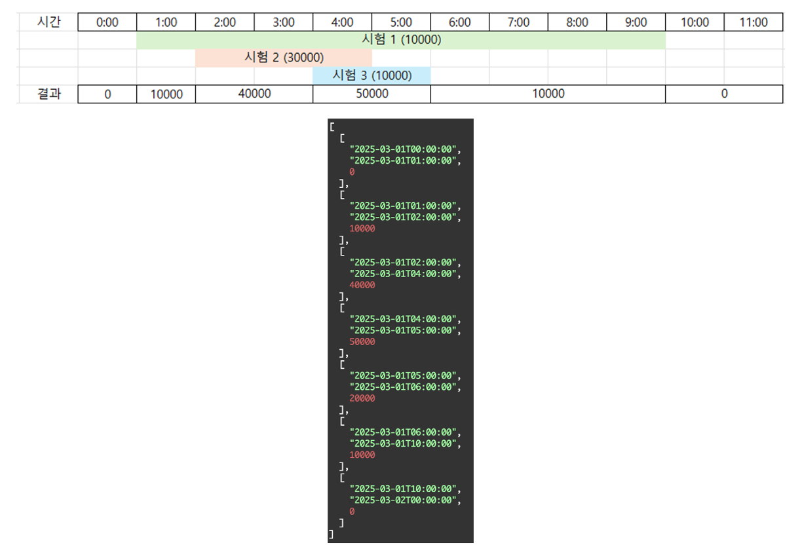

# 시험 일정 예약 시스템 API 개발

## 개요

요구 사항들을 충족하는 시험 일정 예약 시스템을 구현하였습니다.  
FastAPI를 사용하여 구현하였습니다.

- API 호출 시의 Validation을 위해 Pydantic을 사용하였습니다.
- 데이터베이스는 PostgreSQL을 사용하였습니다.
- 데이터베이스 ORM은 SQLModel을 사용하였습니다.

## 문서 목록

- [API 문서](docs/api.md)
- [모델 설명](docs/model.md)
- [설정, 실행, 테스트 설명](docs/setup.md)

시간 상의 문제로 ERM은 생략하였습니다.

## 고려 사항

**동시간대에 5만 명을 초과하도록 예약이 불가능한 제약 조건의 모호한 부분을 아래와 같이 고려했습니다.**

- 예약 시간은 1시간 또는 30분과 같은 슬롯 단위가 아닌, 초 단위까지 자유롭게 지정 가능하도록 구현하였습니다.
- 인원의 변동(증가 및 감소) 기준으로 시구간을 분할하도록 구현하였습니다.
- 성능상의 문제를 예방하기 위해, 조금이라도 겹치는 일정들만을 가져와 스위핑하는 방식으로 구현하였습니다.
- 이 방법을 예약 신청 가능한 시간 조회 시, 예약 생성 시, 예약 변경 시에 적용하였습니다.

이를 그림으로 설명하면 아래와 같습니다.

**과제 설명에서 모호하다고 느낀 부분은 다음과 같이 처리하였습니다.**

- 예약 변경 시에도, 예약 생성 시와 동일한 제약 조건을 적용하였습니다.
- 예약 확정 단계에서는 5만명 제한을 확인하지 않습니다. (인원 여유가 있던 시간대에 대해 동시에 많은 예약이 생긴 경우)
- 어드민은 예약을 신청할 수 없습니다.
